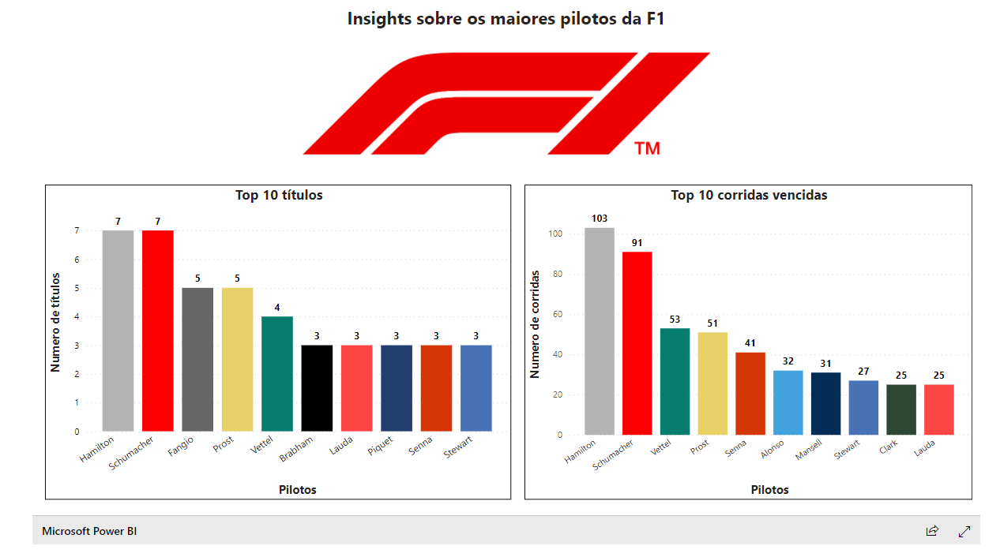

# 🚀 Projeto Modulo 3 

## 💾 Download :
### Utilizando protocolo SSH
    git clone git@github.com:Othonosb/project-database-modulo3.git
### Utilizando protocolo HTTPS
    https://github.com/Othonosb/project-database-modulo3.git

## Como executar
Para visualizar o projeto deve-se abrir o arquivo "index.html", que irá exibir a homepage.

## Base de Dados
#### A base de dados utilizada foi a base da Formula 1 disponiblizada na própria comunidade do Kaggle.A versão utilizadda do dataset continha dados de 1950 até 2022(presente momento).
#### Fonte : https://www.kaggle.com/datasets/rohanrao/formula-1-world-championship-1950-2020

Tanto o schema quanto as queries realizadas para obtenção dos resultados estão disponíveis neste diretório para eventuais consultas.

## Tecnologias Utilizadas
#### Front-End: Bootstrap, Javascript, HTML e CSS
#### Banco de Dados: MySQL
#### Criação dos Gráficos: PowerBI

## Informações Gerais

### Página Inicial

#### Design simples e responsivo criado

#### Seção com insights sobre a Fórmula 1

### Seção Especial Ayrton Senna
Exibição de história e insights sobre Ayrton Senna.

